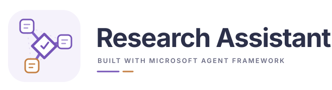

<p align="center">
  <picture>
    <source media="(prefers-color-scheme: dark)" srcset="docs/assets/logo-dark.svg">
    <source media="(prefers-color-scheme: light)" srcset="docs/assets/logo-light.svg">
    
  </picture>
</p>

<h3 align="center">让科研协作进入可运行的工作流。</h3>

<p align="center">用 Microsoft Agent Framework 组织专业角色，把任务、评阅与研究判断接到同一份证据状态。</p>

<p align="center">
  <a href="https://github.com/1187124906zty-commits/research-assistant-maf/actions/runs/36816023993"></a>
  <a href="pyproject.toml"></a>
  <a href="#依赖与兼容"></a>
  <a href="LICENSE"></a>
  <a href="docs/COMMUNITY.md"></a>
</p>

<p align="center">
  <a href="#安装">安装</a> · <a href="#使用">使用</a> · <a href="#看看效果">案例与稿件</a> · <a href="docs/architecture.md">文档</a> · <a href="CONTRIBUTING.md">参与贡献</a> · <a href="#交流与反馈">交流群</a>
</p>

## Research Assistant 是什么？

基于 **Microsoft Agent Framework（MAF）** 的科研多 Agent 助手。科研协调者派发有限任务，文献、证据、机制、写作与评阅角色按需参与；MAF 执行派发、并行汇合和检查点，应用保存证据与研究判断。

- **从一个明确的问题开始。** 专业角色获得相关材料、论断范围、输出目录与返回条件。
- **交付经过评阅再回到决策。** 负面结果可以作为有用回答接收，是否支持假设另行判断。
- **中断后接着已有工作推进。** 科研状态和调用账本分开保存，完成的请求可复用，状态未知的调用须先核实。

这是 [ResearchFlow](https://github.com/1187124906zty-commits/research-workflow) 思路的独立 MAF 重构，包含 **实际工作流、状态 CLI、Codex SDK 提供者、离线演示和真实模型协作样例**。项目自带独立角色与 skills；既有工具可在任务中明确接入。实现与边界见 [架构说明](docs/architecture.md)。

针对完整论文的协作方法见 [章节研究与全文论证](docs/manuscript-collaboration.zh.md) 、[论文审查模式](docs/manuscript-audit.zh.md) 和 [AMMT 实质修订案例](examples/ammt-deep-revision/README.md)。本次已实际开展近邻文献学习、原生 MAF 分章写作、Codex 章节交叉审阅与全文整合；原生写作批次的讨论返回超时，后续由主协调者接收实际文件并组织独立评阅。它验证了有人工协调的研究路径，尚未实现完整论文的自主编辑调度。

## 安装

需要 **Python ≥3.11**。推荐使用项目虚拟环境，Windows PowerShell：

```powershell
git clone https://github.com/1187124906zty-commits/research-assistant-maf.git
cd research-assistant-maf
python -m venv .venv
.\.venv\Scripts\Activate.ps1
python -m pip install -e ".[codex]"
```

`[codex]` 安装可选 Codex Python SDK；只运行离线演示时使用 `python -m pip install -e .`。Linux 可用 `source .venv/bin/activate` 激活环境，其他安装命令相同。

真实任务需要当前主机上可用的 Codex 账户与环境，首次使用按其官方方式登录。本项目采用 SDK 默认模型与会话设置；每个角色请求启动独立 SDK 线程，审批策略按提供者实际设置核对。

## 使用

| 你想做什么 | 从这里开始 |
|---|---|
| 先检查安装与工作流 | 执行离线 `demo`，查看生成状态与报告 |
| 开展真实协作 | 通过 `run --provider codex` 提交研究目标、材料位置和可用工具 |
| 查看或恢复已有项目 | `status` 与 `resume`；未知调用先查原会话和产物 |
| 查看实际产物 | [AMMT 研究稿](https://github.com/1187124906zty-commits/research-workflow/blob/codex/researchflow-release/paper/ammt-study/manuscript.pdf)与[有限模型协作样例](examples/live-coordination/README.md) |

先运行无需模型账户的演示：

```powershell
research-assistant demo ./workspaces/demo-study
research-assistant status ./workspaces/demo-study
```

演示通过实际 MAF 工作流执行预设提供者返回，检查协议与状态转换。开展真实任务时：

```powershell
research-assistant run ./workspaces/my-study --brief "调查项目中的研究问题，核对已有证据与方法条件，安排有限验证并形成有来源的报告。材料与代码位于项目目录。" --max-cycles 4 --parallel 2 --provider codex
research-assistant status ./workspaces/my-study
```

每项研究使用独立项目目录。`--max-cycles` 限制工作流循环，`--parallel` 在 1–4 之间限制同时派发的角色任务；一次角色调用内部的求解器运行与资源预算仍需单独约定。

<details>
<summary><strong>恢复、追加有限工作与核实未知调用</strong></summary>

```powershell
research-assistant resume ./workspaces/my-study
research-assistant resume ./workspaces/my-study --additional-cycles 2
```

恢复从最新科研状态重新进入协调者，并复用账本中的完成返回。已完成项目保留状态；`--additional-cycles` 只显式重开 `needs_input` 或 `budget_reached`，不自动扩大专业任务的尝试预算。

外部调用已经开始但完成情况未知时，先核实原会话、进程与产物。确认实际返回后可关联结构化结果，再恢复：

```powershell
research-assistant reconcile ./workspaces/my-study "worker:task-id:1" ./inspected-response.json --reason "已核实原会话与现有产物，此文件保存其实际返回。"
research-assistant resume ./workspaces/my-study
```

实际请求 ID 从 `status` 查询，返回文件须符合该请求的输出 schema。导入返回与认定科学支持分开处理。

</details>

## 看看效果

**AMMT IN625 激光熔池：在真实研究产物上准备与评阅稿件。**

<p align="center">
  <a href="https://github.com/1187124906zty-commits/research-workflow/blob/codex/researchflow-release/paper/ammt-study/manuscript.pdf">
    
  </a>
</p>

案例将公开 AMMT 实验条件、三维传导与相变计算、工况和高温物性对照，组织成有来源与适用范围的英文研究稿。本次 ResearchFlow / MAF 协作用于稿件准备与评阅，讨论计算观察能够支持哪些结论，以及哪些模型条件需要继续说明。

**数值计算原由 [SimAgent](https://github.com/1187124906zty-commits/simulation-agent-research) 执行。** B 工况长度参与有效热源因子标定，A/C 为固定参数非盲比较。R2 初稿使用 39 项相关引用和五幅科学图，区分几何标定、后部相界响应与派生材料时间；研究稿保存在 ResearchFlow 仓库，尚未经期刊同行评审。

[阅读稿件 PDF →](https://github.com/1187124906zty-commits/research-workflow/blob/codex/researchflow-release/paper/ammt-study/manuscript.pdf) · [编辑 LaTeX 源文件 →](https://github.com/1187124906zty-commits/research-workflow/blob/codex/researchflow-release/paper/ammt-study/manuscript.tex) · [来源与交付范围 →](https://github.com/1187124906zty-commits/research-workflow/tree/codex/researchflow-release/paper/ammt-study)

[实际 MAF 执行记录](examples/ammt-manuscript/README.md)包含两项专业输出、独立评阅、一次局部归因修订、协调者处置和明确记录的证据路径恢复。该有限会话已完成；它检验本次协作路径，科研效率与发现质量尚需独立效果评价。

[R2 分章写作与中断诊断](examples/ammt-deep-revision/README.md)展示更深入的研究修订：真实引言和讨论章稿、不同章节的论证责任、输入冻结及超时处置。该批次的原生 reviewer/requester 未执行；稿件的章节互审和全文审查由 Codex 研究队伍另行完成。两次运行的完成范围分别记录。

<details>
<summary><strong>再看一个有限的真实模型协作样例</strong></summary>

[合成数值的分析与报告](examples/live-coordination/README.md)实际执行了 Codex 专业分析、写作、独立评阅和协调者处置。公开文件保留原始输入、分析与报告；开发中发现的交接问题、显式恢复及修正均有说明。

输入是给定合成数值。样例完成描述性算术核对与文件交接，没有启动物理求解器，不能由 coarse/fine 标签推断收敛或精度提高。

</details>

## 依赖与兼容

| 层次 | 当前条件与已检查范围 |
|---|---|
| Python 应用 | Python ≥3.11；安装构建使用 `setuptools>=77` |
| 执行框架 | 固定 `agent-framework-core==1.19.0`；实际 MAF 工作流、并行汇合与检查点 |
| Codex 提供者 | 可选 `openai-codex==0.159.3`；主机需有可用账户与权限 |
| 专业工具 | 求解器、许可、实验数据、设备与其他写作产品按研究任务独立配置 |
| 已检查平台 | Windows / Linux × Python 3.11、3.13 CI；真实 Codex 有限验收在 Windows / Python 3.12.14 完成。macOS 尚未测试 |

MAF 支持的其他提供者须在本应用中另行实现与验证。项目随包提供独立角色与 skills，既有全局 skills 继续由各自维护。科研状态、MAF 检查点和调用账本的职责见 [架构说明](docs/architecture.md)。

任务契约、输出范围和角色身份是协议约束，宿主权限与工具适配器决定实际执行边界。默认上下文包上限为 60,000 字符，超限请求会拒绝；论文和科学解释仍需依据实际证据。

## 验证与贡献

[MAF CI](https://github.com/1187124906zty-commits/research-assistant-maf/actions/runs/36816023993) 四组环境通过，执行 66 项测试、实际离线工作流、构建与源码目录外的 wheel 安装检查。[验证记录](docs/validation.md)进一步区分软件路径、有限真实模型协作与尚未开展的科研效果评价。

```powershell
python -m unittest discover -s tests -v
python -m research_assistant demo ./local-runs/check-demo
```

欢迎改进提供者、工具适配、状态恢复、研究案例和文档。可 [提交 Issue](https://github.com/1187124906zty-commits/research-assistant-maf/issues/new) 或按 [贡献指南](CONTRIBUTING.md) 提交 Pull Request，附可复现材料与实际验证范围。

## 交流与反馈

**QQ 交流群：基米绿豆 研习群 · 871287830**

<p align="center">
  <a href="docs/COMMUNITY.md"></a>
</p>

欢迎交流多 Agent 科研、MAF 工作流、工具接入与使用反馈。需要跟踪的问题请同步到 Issue；二维码失效时可搜索群号。[社区说明 →](docs/COMMUNITY.md)

## 继续了解

[架构与边界](docs/architecture.md) · [验证记录](docs/validation.md) · [真实模型协作样例](examples/live-coordination/README.md) · [ResearchFlow](https://github.com/1187124906zty-commits/research-workflow) · [贡献指南](CONTRIBUTING.md)

项目采用 [MIT 许可](LICENSE)。状态实现来源、上游软件与案例材料范围见 [第三方说明](THIRD_PARTY.md)。
