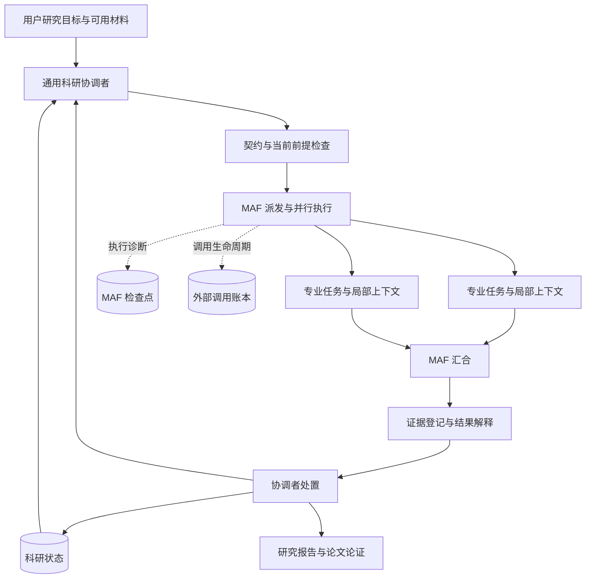

# 架构与责任边界

本项目以 Microsoft Agent Framework 作为执行载体，将科研协调协议放在应用层。目标是让每次派发、返回和反馈与当前研究问题建立明确联系，并在中断后保留可检查的研究理解。

## 结构

MAF 承担实际执行组织：路由、并行、汇合和检查点。`Coordinator` 向有限数量的 `Worker` 派发任务，`Collector` 在收到本批全部结果后串行导入，再返回协调者。应用层负责科学对象、任务边界、上下文生成和处置要求。专业角色判断模型、数据和解释。系统使用上游包，不维护 MAF 源码分支。

## 领导者与专家

协调者的专业能力要求是理解问题、假设、对照、证据范围和不确定性之间的关系。它需要识别决策所缺的信息，并能要求专家说明判断依据。

协调者负责：

- 维护当前研究问题、已确认事实、假设、关键不确定性与下一决策。
- 为专业任务说明目的、范围、输入、接受依据、预算和返回条件。
- 安排互不冲突的并行输出，解释独立评阅提出的问题。
- 对结果进行处置，解释其对整体研究的贡献。
- 将改变认识的内容合入项目状态，并为后续角色重新生成相关上下文。

专业角色负责在契约范围内深入执行，说明实际观察、方法前提、验证层次和限制。它们可以报告原问题不可回答、提出替代方案或返回负面发现。重要范围变化和新增昂贵工作应交回协调者判断。

协调者不能通过宣布“全局已经足够”消除单位错误、无效边界条件、来源缺失或真实反证。另一方面，某专业角色的理想精度或理想数据规模也不能自动变成全项目的通用标准。

## 研究循环

一次循环包含五项责任：

1. **更新理解**：说明当前最值得区分的认识，以及新的行动可能改变什么。
2. **建立契约**：确定问题、用途、论断范围、输入版本、输出与写入目录、依赖、接受依据和预算。
3. **专业执行**：在有限上下文中读取必要原件，生成实际产物与结构化结果。
4. **解释与评阅**：区分观察、支持、负面发现和反证，说明研究理解是否改变；由独立角色先检查问题与原始证据。
5. **请求者处置**：接收、继续、收窄、重构或暂存当前任务，再选择下一行动。

这是可以反复调整的研究循环。文献、模拟、机制和写作可以在不同阶段重新参与；论文框架需要随证据变化。

`--max-cycles` 控制本次自动执行的循环范围，`--parallel` 在 1–4 之间限制同时派发的专业调用。契约中的尝试与无进展预算针对登记的任务返回。这些参数都不表示一次专业调用内部只能运行固定数量的求解器。若需要精确限制计算资源，应将求解器提交、查询、取消和收集产物接入可计数的工具服务。

当前每次新的专业任务返回都会执行独立评阅；评阅返回也登记为任务并接收，其接受不等于论断获得支持。无论是当前专业问题的受影响论断，还是写作中的重要来源与读者问题，阻碍都需要相应处置。独立评阅会增加调用成本，后续可根据真实使用评价哪些任务适合更轻的反馈。

## 结果与贡献

一个有用的返回应同时包含实际产物与解释：回答了什么问题，观察了什么，证据在哪里，支持或限制哪些论断，还有什么未分辨，下一项工作能区分什么。

接收交付与支持假设是两个独立动作。负面结果可能排除一个错误方向，对项目具有重要价值。程序支持这种区分，但无法自动判断一项结果的科学价值。协调者仍要根据专业依据进行处置。

对于规则检查已明确拒绝、且未提交科学状态变化的处置，协调者得到一次有限纠正机会：请求包含原处置、具体错误和已有证据，不增加专业任务、不改写科学标准。第二次无效处置返回待处理状态。传输失败、超时和完成状态未知的调用不走自动纠正路径。原返回及纠正理由保留在执行账本中。

连续无进展需要策略重审：明确为什么继续、方法有什么改变，以及新增工作能够区分什么。重审不意味着自动放弃，也不意味着可以无限追加预算。一次返回中的 `changed_understanding` 是专业报告，真实性和意义需要协调者解释。

## 上下文

上下文分为项目理解、局部任务和原始材料三层。

| 层次 | 内容 | 使用方式 |
|---|---|---|
| 项目理解 | 问题、贡献设想、事实、假设、反例、不确定性和下一决策 | 协调者维护，供任务生成使用 |
| 局部任务 | 目的、必要前提、输入位置、论断范围、预算及返回要求 | 每个 worker 按当前契约获取 |
| 原始材料 | 文献、数据、代码、模型、运行日志和结果 | 按需读取；重要判断保留可定位来源 |

状态摘要帮助导航，不能替代重要原件。局部上下文保留影响判断的限制与反例，避免只传递生产者对结果的乐观总结。角色使用各自的任务上下文；恢复任务时仍需核对当前前提。默认 JSON 上下文包上限为 60,000 字符，超限时拒绝请求，不自动裁剪证据；这是字符长度检查，不是精确 token 配额，也不限制工具随后读取的原件大小。

## 持久化与恢复

科学状态、执行检查点和调用账本各有职责。

**科学状态**保存在 `.research-assistant/research-state.json`，事件记录为状态变化提供检查依据。专业角色产生分离的输出，协调端导入结果和处置。并行 worker 不直接同时修改共享研究状态。

**MAF 检查点**保存在 `.research-assistant/checkpoints/`，记录执行位置与消息。当前版本把它们用作执行诊断，不将旧图消息作为恢复入口。`resume` 重建 MAF 工作流，从协调者开始读取最新科学状态，处理已有交接，再决定当前有效的任务。这样不会把旧检查点中的研究认识直接恢复为当前结论。

**调用账本**保存在 `.research-assistant/execution.json`，包含会话信息、请求和成功返回。相同请求身份的已完成返回会被复用。中断可能发生在外部任务已经完成、结果尚未入账之间；记录为 started、failed 或 interrupted 的调用都不会自动重放，需要核对真实任务状态。

复用还要求当前请求与原请求的实质内容匹配，并检查已保存的专业产物版本；全局状态序号因无关并行返回变化不会单独使缓存失效。缓存意味着复用已核对的返回，不能把同一任务身份应用到另一组前提。

`reconcile` 允许在核实已有会话和产物后，将符合原 schema 的结构化结果显式绑定到未知调用，并保存理由。它不会执行模型调用，不允许替换已完成返回，也不直接授予科学支持。随后恢复仍走科研结果导入、独立评阅与请求者处置。

已完成、需要用户输入或已到循环预算的会话保留停止状态。`resume` 用于恢复执行与交接，不会自动增加预算或为缺失的用户输入编造答案。

显式使用 `resume --additional-cycles N` 可在缺失前提处理后或预算重审后，追加有限循环并重开 `needs_input` / `budget_reached` 会话。重开会产生新的规划代次，避免把先前“需要输入”的判断作为当前判断复用。这个操作不重开已完成项目、不重放未知调用，也不修改专业任务自身的尝试上限。

检查点不能保证外部副作用只发生一次。停止工作流也不一定停止已启动的求解器。扩展求解器时，应保存外部任务身份、输入版本和产物位置，使用查询恢复而非重复提交。

## 科学状态的检查范围

当前状态内核检查：

- 任务契约及声明的输出范围。
- 输入与证据的文件版本绑定。
- 结果是否仍待请求者处置。
- 支持是否对应指定论断与验证层次。
- 反证和阻碍是否未解决，以及它们影响的依赖。
- 继续任务是否需要预算与策略重审。

证据层次区分 `observation`、`numerical_verification` 和 `physical_validation`。数值核验不能因为程序运行成功就升级为物理验证。反证影响有关论断与依赖，不要求无关任务全部停止。

文件版本绑定使用内容摘要，目的是在后续修改时发现科学支持所依赖的产物已经变化。它不判断数据质量、方法正确性或科学意义。

返回证据可指向声明写入范围内的产物，或任务已登记的原始输入。后一种情况必须保持派发时的版本；项目外的文献文件可作为明确声明的输入，不因引用而成为允许修改的输出。未声明路径和已变动的输入在导入前被拒绝。

角色身份和写入范围是应用协议。没有操作系统权限隔离时，任意 shell 操作仍可能绕开协议。程序不会宣称已经拦截所有编辑、网络调用和计算。

## 提供者与工具

离线演示提供者用于确定性软件验证。它产生预设结果，帮助检查 MAF 执行及状态转换，不产生真实研究发现。

Codex 提供者通过可选的官方 Python SDK 执行实际角色任务，使用主机可用的 Codex 账户配置和 SDK 默认会话设置。每次请求启动新的 SDK 线程，并记录对应线程身份。它不覆盖模型与 sandbox 配置；SDK 默认审批策略不等于继承桌面线程的审批设置。MAF 看到的是一次角色调用；角色内部工具使用受到 Codex 本身的环境与权限约束。外部框架不会自动获得对每条内部工具调用的细粒度控制。

独立角色说明与 skills 作为本包资源分发。它们提供任务方法，不自动安装到全局 Codex skill 目录。既有用户 skills、PaperSpine 和科研软件仅在已配置并可访问时成为具体任务的能力；声明一个名称不等于相关产品服务已经接通。

## 扩展顺序

适配新的模型或专业工具时，优先保持以下接口：

1. 明确有限任务与真实运行环境。
2. 记录外部调用开始、返回与失败状态。
3. 返回可定位产物和结构化解释。
4. 由协调端串行导入和处置。
5. 在恢复时核对当前前提，处理未知副作用。

多求解器、独立工具进程、精确资源计数、团队服务和更复杂界面可以后续增加。首先评价一个完整科研任务中是否减少重复劳动、正确使用负面证据、维持证据范围，并完成有效交接。工作流能跑通只证明相应软件路径可运行，不能证明科研质量或发现速度已提高。
